### **ref打标识**

方法里面用$refs来获取标签对象

### props接受参数

1. 数字方式
2. 


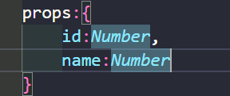


3.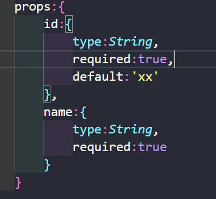

### vuex

Vue ui打开创建vue项目

可以自定义选项卡

语法检查较重

主要是空格的问题

不管是变能量还是符号等等都需要空格不然会报错造成项目运行失败

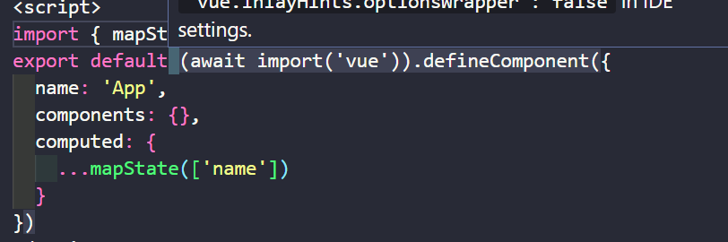

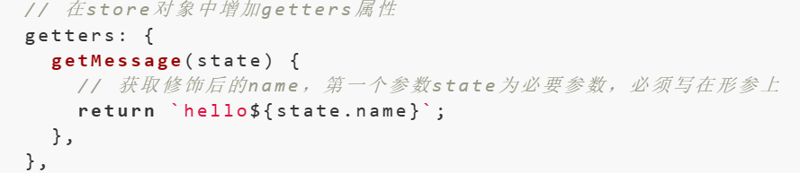

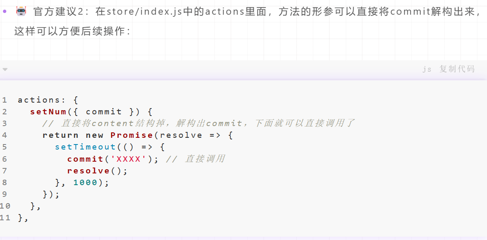

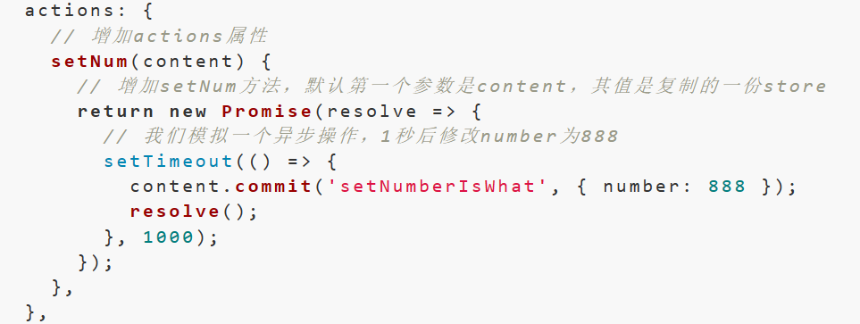

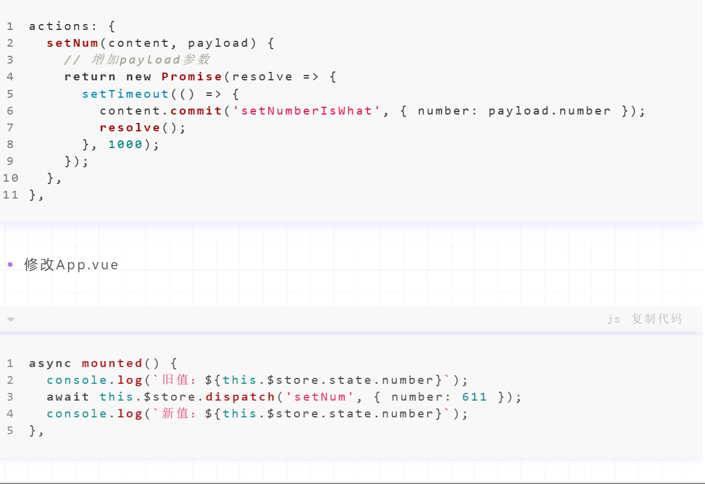


**采用的是按属性的方式去拆分，将getters/actions/mutations等属性拆分到不同的文件中。**


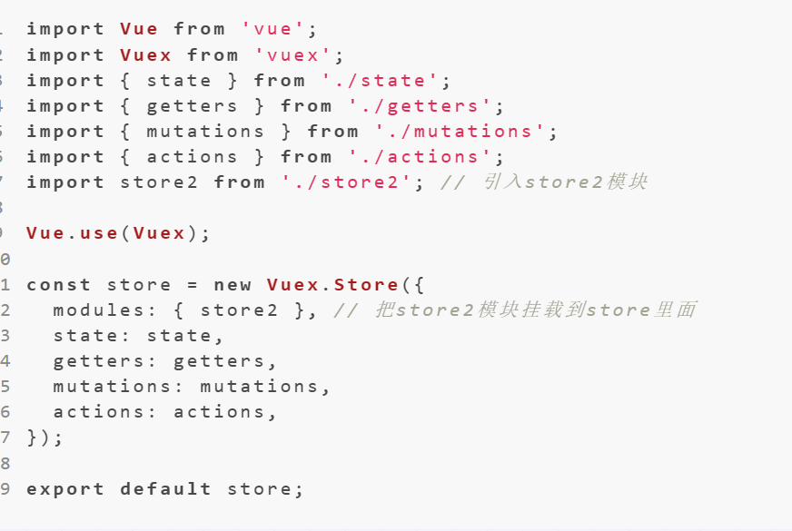

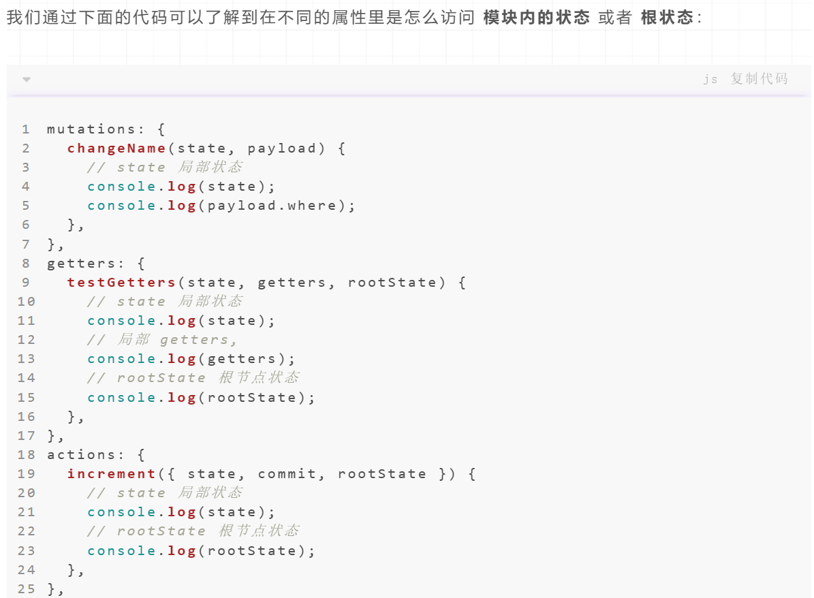


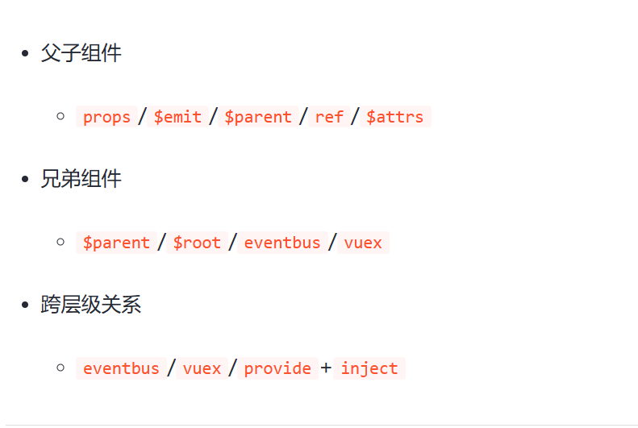

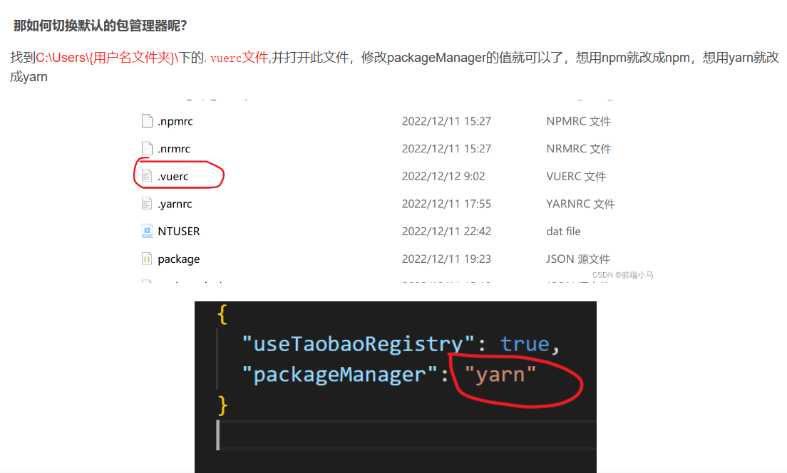


### 下载的nrm运行命令可能会报错

原因是版本过高解决方法：npm install -g nrm [open@8.4.2](https://link.juejin.cn/?target=mailto%3Aopen%408.4.2) --save


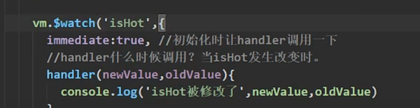

全局安装webpack: npm i webpack -g 4. 创建项目：vue init webpack 项目

使用vite创建vue3项目

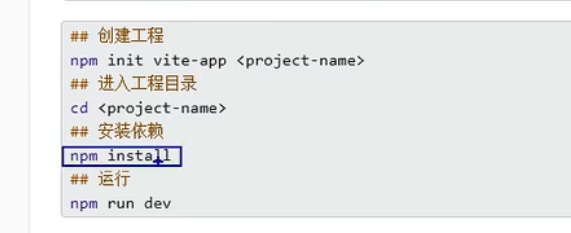

 render: (*h*) => h(App)

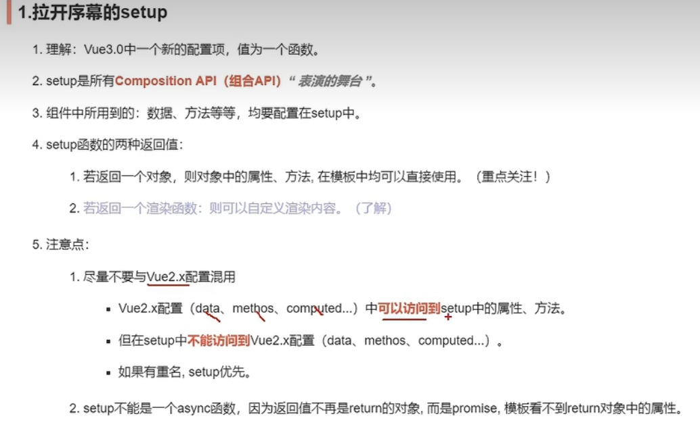

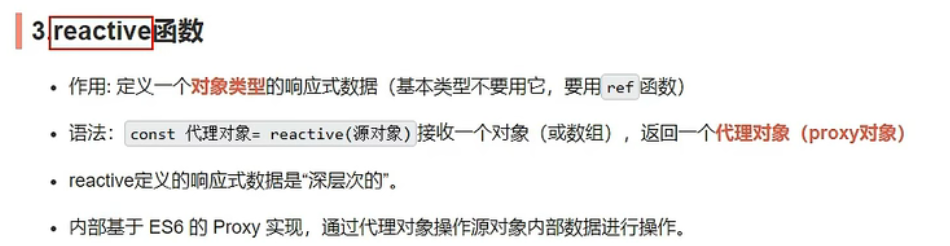

### **vue中不用prop接受可以用attrs来读取但是不能限制类型**

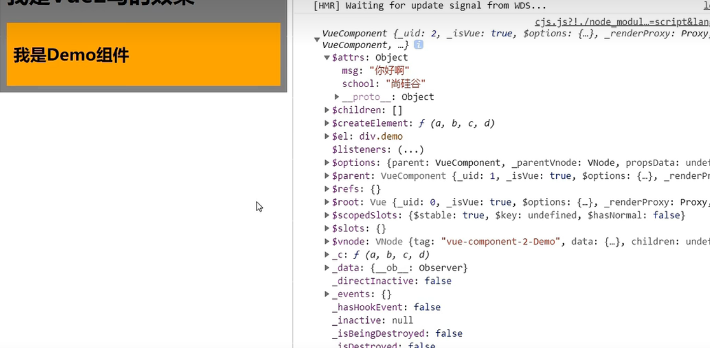

### Object.defineProperty参数

### 1.属性所在的对象
2.属性的名字
3.一个描述符对象

这个描述符对象是个什么东西呢？
他可以是 数据属性：

1.configurable:表示能否通过delete删除属性从而重新定义属性，能否修改属性的特性，或者能否把属性修改为访问器属性，默认值为false。

2.enumerable：表示能否通过for in循环访问属性，默认值为false

3.writable：表示能否修改属性的值。默认值为false。

4.value：包含这个属性的数据值。默认值为undefined。


### 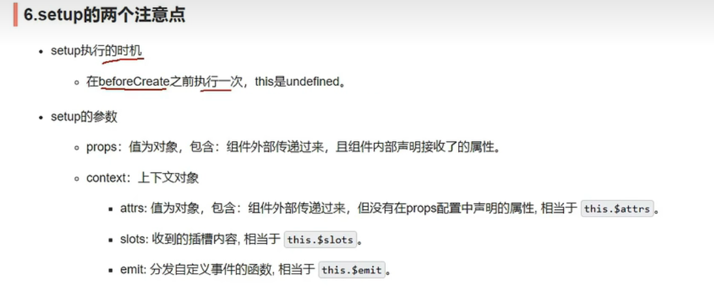

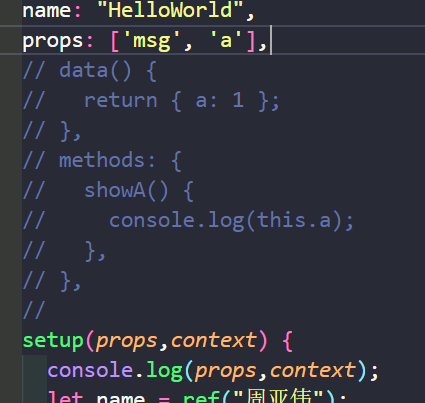

### **运用emit的时候需要接受emits:['hello']**

### **使用插槽时，不能使用 `slot="XXX"`,要使用`v-slot`，不然会报错**

### **这是计算属性**


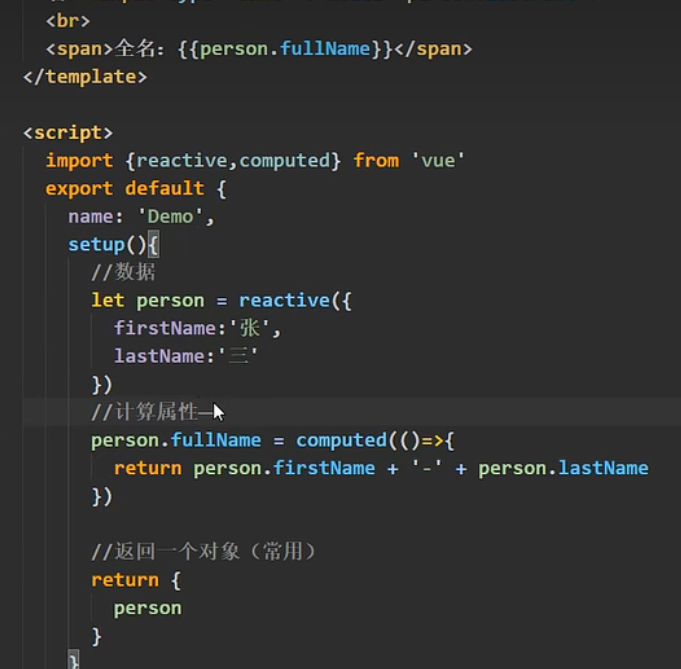

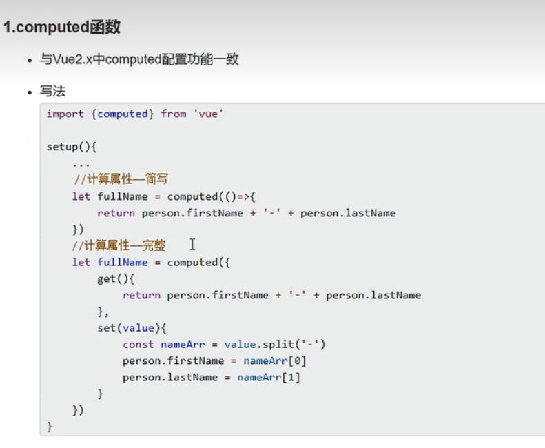

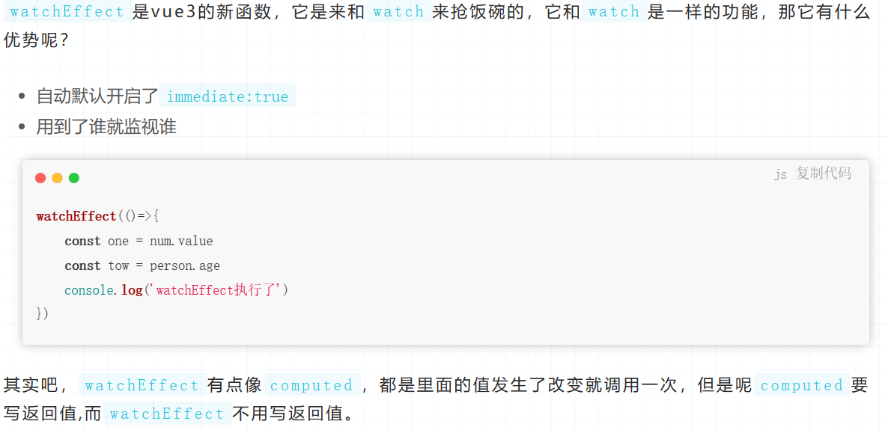

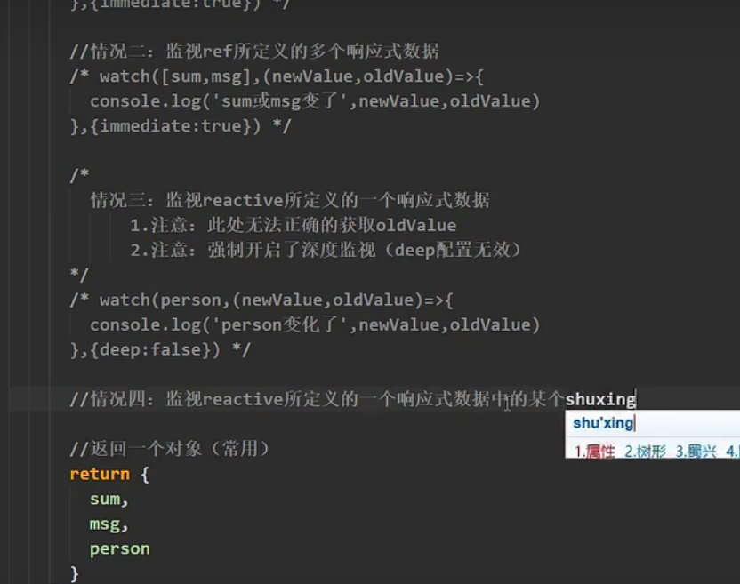

watch监视reactive定义的数据

默认开启深度监视

要写成函数（）=>p.name

如果嵌套层级较深则需要开启深度监视

ref定义的对象

监视job1.value也可以开启深度监视

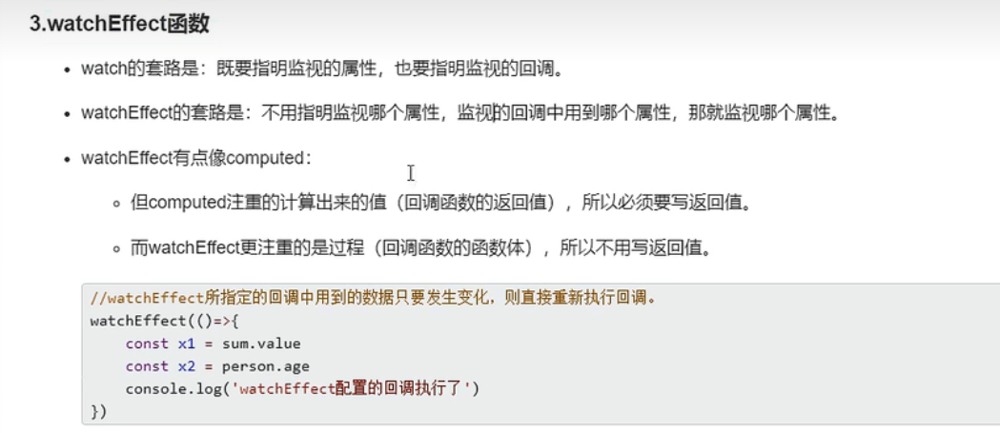

### **shallowReactive定义的对象数据只能修改第一层的数据**

### **shallowRef不处理对象类型的**

### vue3 vite项目

我们这里搭建一个最新的Vue3 + TS + Vite项目

```js
npm create vite@latest my-vite-app --template vue-ts
```

```js
npm install
npm run dev
```

## 安装pinia

```js
yarn add pinia
# 或者使用 npm
npm install pinia
```

```text
// 第一个参数是应用程序中 store 的唯一 id
export const useUsersStore = defineStore('users', {
  // 其它配置项
})
```

创建store很简单，调用pinia中的defineStore函数即可，该函数接收两个参数：

- name：一个字符串，必传项，该store的唯一id。
- options：一个对象，store的配置项，比如配置store内的数据，修改数据的方法等等。

我们可以定义任意数量的store，因为我们其实一个store就是一个函数，这也是pinia的好处之一，让我们的代码扁平化了，这和Vue3的实现思想是一样的。

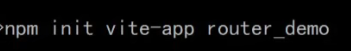

npm install vue-router@next -S

// 1 从vue-router按需导入两个方法
// createRouter方法用于创建路由实例对象
// createWebHashHistory方法用于指定路由的工作模式（hash模式）
import { createRouter, createWebHashHistory } from 'vue-router'