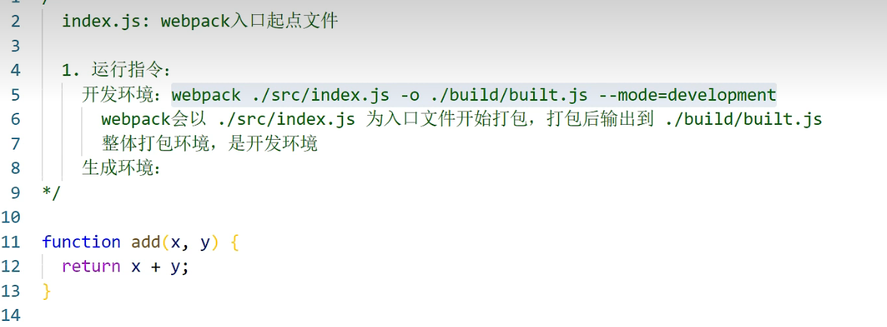
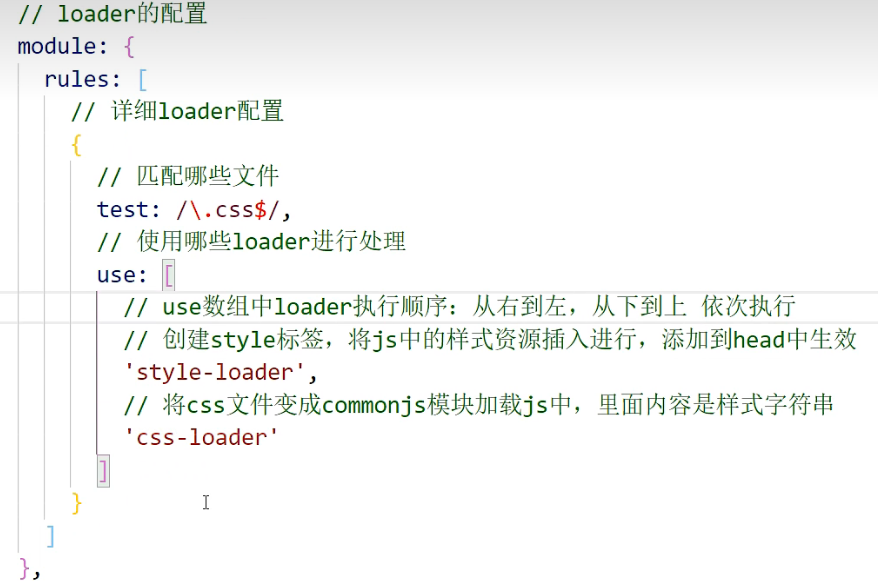

npm install webpack webpack-cli -g  //全局安装,作为指令使用

npm install webpack webpack-cli -D //本地安装,作为本地依赖使用

npm install webpack webpack-cli -g
npm install webpack webpack-cli -D
# 本地安装
cnpm i webpack@4.41.6 webpack-cli@3.3.11 -D

开发环境webpack ./src/index.js -o ./build/built.js --mode=development

生产环境webpack ./src/index.js -o ./build/built.js --mode=production 

只能打包js、json

