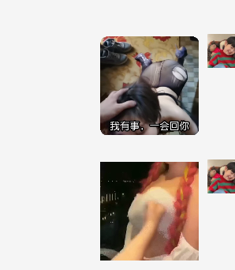

**我怎么想的？我想的也很简单，就是找一个好工作，赚到了钱结婚，买车，买房，养孩子等等一系列事情，时间过得很快，咱俩都谈了一年了，发生的事情也很多啊，尽管你无理取闹，爱吵架，但是也过来了，大概率结婚就是你了，我家条件也不是很好，我很清楚我缺什么，就是钱啊，和别人不一样，人家父母安排房,车一类的东西，当然也不是特别不堪，就是很平常一样，但是车房得靠我自己，可能以后有很多事情，慢慢来吧，在不见面的时间里，我也想你啊，哪有不想自己对象的啊，在一起的时间也很开心啊，在郑州的时间大家都很开心啊，等着赚到钱了一起去看海，去好多地方去玩，一定玩个够，其实有时候煽情的情况真的很想哭，记得第一次在石家庄的时候送你走的时候，太煽情了，真的想哭，虽然发生了一些不好的事情，你也没有意识到，我也说了很长时间，可能是我想的太多了，我只想两个人一起呆着玩，而不是三个人，可能那时候我还比不上你的好姐妹吧，我也不知道什么原因，就是很生气，谈恋爱的过程中难免有一些不愉快的事情发生，动不动就吵架，摆臭脸，就不高兴了，我还得哄你，有时候是你的错，你还不承认，还蛮不讲理，很让人生气，主要是我脾气比较好，当然我有时候我也会生气，我也有很多不好的地方，慢慢改呗，本来就是一个磨合的过程，接受对方不好的地方，慢慢适应并且改掉不好的地方，以后的时间还长，有很多不确定的因素也有很多的事情需要共同去解决，自己内心强大一点，不要不好意思，其实没有那么多人在意你，其他异样的眼光可能会使你不好意思，但是也没有什么关系，自己聪明一点学精一点，其实有时候拒绝可以避免很多事情的发生，出门在外，注意安全，你也可以偷懒，毕竟你这行比较累，事情比较多，遇到的人很杂，发生的事情有很多预料不到，但是自己学精一点，可能就能避免。**

