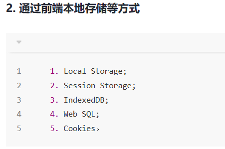
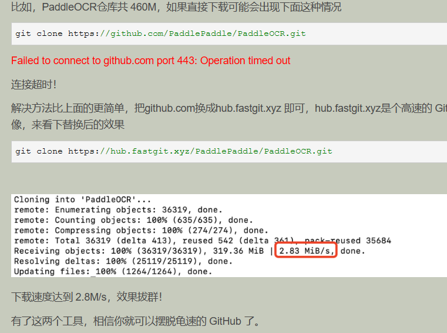

[VeraCrypt - 免费的开源磁盘加密，为偏执狂提供强大的安全性](https://www.veracrypt.fr/code/VeraCrypt/)

**步骤1.** 按**Win+R**输入**gpedit.msc**并按**Enter**键打开组策略编辑器。

**步骤2.** 转到此路径：**计算机配置>管理模板>系统>设备安装>设备安装限制**。

`undefined` 来判断一个变量是否已赋值

箭头函数可以返回一个对象（{}）

Checkout：把SVN仓库的代码下载到本地，比如你现在参与一个团队的项目，在你参与之前项目可能已经在运行或者技术主管也已经搭建好代码仓库，你可以通过checkout命令项目代码，获取相应的项目的代码。

Update：在你编写代码的过程中，项目参考者很可能已经提交过代码到SVN服务器，而你本地项目都是自己编写，肯定没有其他参与者新提交的代码，你可以通过update SVN获得SVN最新的代码。

Commit：当你完成一部分开发后并且程序中没有其它的错误，你可以通过commit提交代码到SVN服务器，服务器会产生一个新的版本，这样其它参与者就可以获取到您相应提交的代码。重要提示：每次必须先先update再Commit。

 ipconfig /flushdns 刷新dns